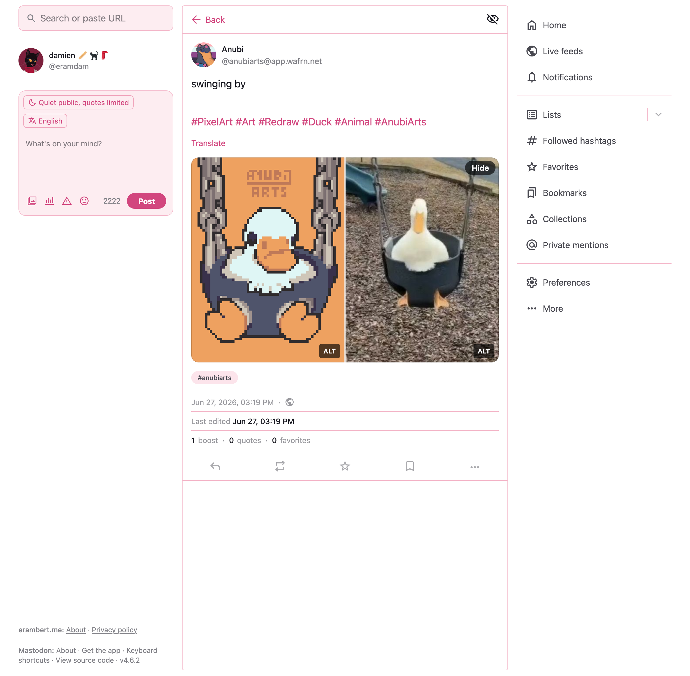
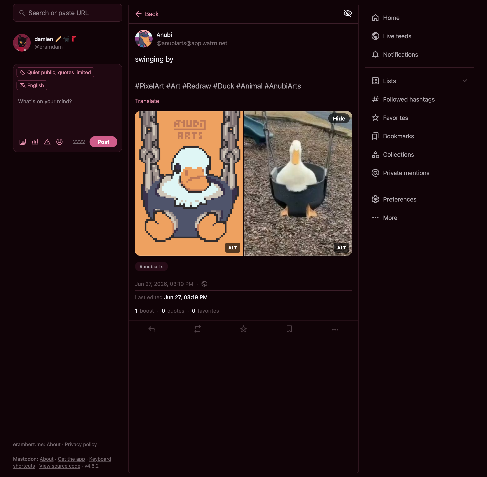
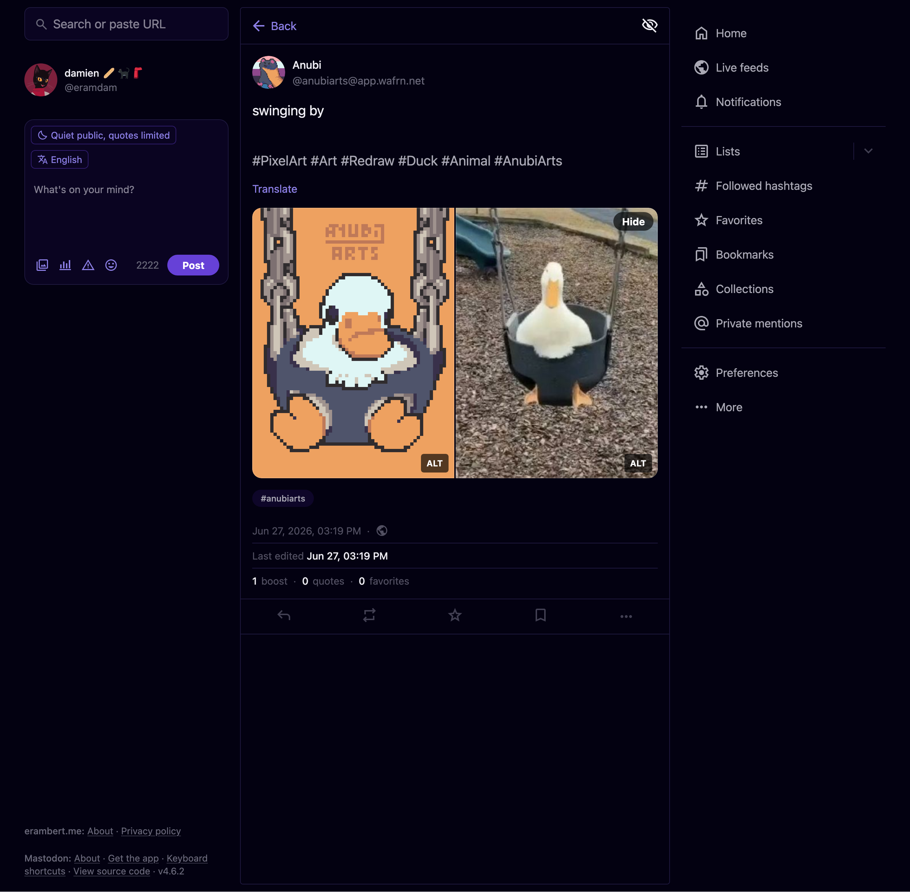

# Colorful Mastodon 4.6

Custom CSS theme for Mastodon 4.6 that changes the colors and other small things.
Based on [Cassidy’s CSS tweaks for mastodon.blaede.family](https://gist.github.com/cassidyjames/292c1e3062ad5248284999e4c7841a17), which itself was inspired by @nileane's [TangerineUI](https://github.com/nileane/TangerineUI-for-Mastodon). The purpose of this theme is to modify as few things as possible and leverage [Mastodon 4.6's design tokens](https://docs.joinmastodon.org/dev/frontend/design-tokens/) to achieve a cleaner/more colorful look easily.

# Examples

"Cherry" red theme

 

Indigo theme

 

