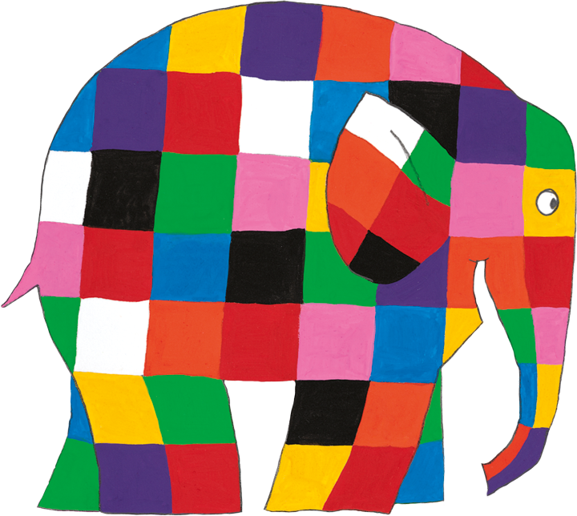

<h1>Elmer for Mastodon </h1>

<small>Named after [Elmer the Patchwork Elephant](https://en.wikipedia.org/wiki/Elmer_the_Patchwork_Elephant).</small>

Elmer is a custom theme for Mastodon 4.6+ that leverages the [Mastodon design system](https://docs.joinmastodon.org/dev/frontend/design-tokens/) to easily achieve a colorful look based on only one or two base accent colors.

## Inspirations

Based on [Cassidy’s CSS tweaks for mastodon.blaede.family](https://gist.github.com/cassidyjames/292c1e3062ad5248284999e4c7841a17), which itself was inspired by @nileane's [TangerineUI](https://github.com/nileane/TangerineUI-for-Mastodon).
